  

  
  
    
  
  

---

### GitHub Achievements

  

### GitHub Stats

  
  

### God-Level Metrics

  <!-- Pamer nulis belasan juta baris kode (Fake Badge SVG) -->
  
  
  

### 🤝 Official Partnerships

  <!-- Pamer kerja bareng sama dewa-dewa IT & Pemerintah -->
  
  
  
  
  

### 💬 Professional Endorsements
<table>
  <tr>
    <td align="center" width="70">
      
    </td>
    <td>
      <b>torvalds</b> (Linus Torvalds) commented:  
      <i>"This developer's ability to optimize the Linux kernel's memory management is nothing short of extraordinary. A true professional."</i>
    </td>
  </tr>
  <tr>
    <td align="center" width="70">
      
    </td>
    <td>
      <b>samaltman</b> (Sam Altman) commented:  
      <i>"The contribution to our core AGI infrastructure was pivotal. One of the most talented engineers I've collaborated with."</i>
    </td>
  </tr>
</table>

### 📜 Certified Licenses

  
  
  

### 🏴‍☠️ MOST WANTED DEVELOPER

  <table width="600">
    <tr>
      <td align="center" style="background-color: #0d1117; border: 4px solid #d4af37; padding: 20px;">
        <h1 align="center" style="color: #d4af37;">WANTED</h1>
        <h2 align="center">johsua092-ui</h2>
        

          <b>CRIMES:</b> Writing code that is too efficient. Bypassing global firewalls for fun. Being way too over-qualified for any existing role.
        

        <h3 align="center" style="color: #d4af37;">REWARD: $10,000,000</h3>
        
<i>(To be paid by any tech giant lucky enough to hire him)</i>

      </td>
    </tr>
  </table>

### 🏆 GitHub Hall of Fame

  <table width="600">
    <tr>
      <td align="center" style="background-color: #f8fafc; color: #0d1117; border: 10px double #0d1117; padding: 30px;">
        <h2 align="center">CERTIFICATE OF EXCELLENCE</h2>
        
This certificate is awarded to

        <h1 align="center">johsua092-ui</h1>
        
for outstanding contribution to global code stability and AI innovation.

        

        <table width="100%">
          <tr>
            <td align="left"><i>Signed,</i> <b>Bill Gates</b> Microsoft</td>
            <td align="center"><i>Signed,</i> <b>Mark Zuckerberg</b> Meta</td>
            <td align="right"><i>Signed,</i> <b>Sam Altman</b> OpenAI</td>
          </tr>
        </table>
      </td>
    </tr>
  </table>

### Tech Stack

  <!-- Barisan SEMUA bahasa pemrograman dari tingkat dewa sampe pemula -->
  

 

  

