  

  
  
    
  
  

---

### GitHub Achievements

  

### GitHub Stats

  
  

### God-Level Metrics

  <!-- Pamer nulis belasan juta baris kode (Fake Badge SVG) -->
  
  
  

### 🤝 Official Partnerships

  <!-- Pamer kerja bareng sama dewa-dewa IT & Pemerintah -->
  
  
  
  
  

### Tech Stack

  <!-- Barisan SEMUA bahasa pemrograman dari tingkat dewa sampe pemula -->
  

 

  

